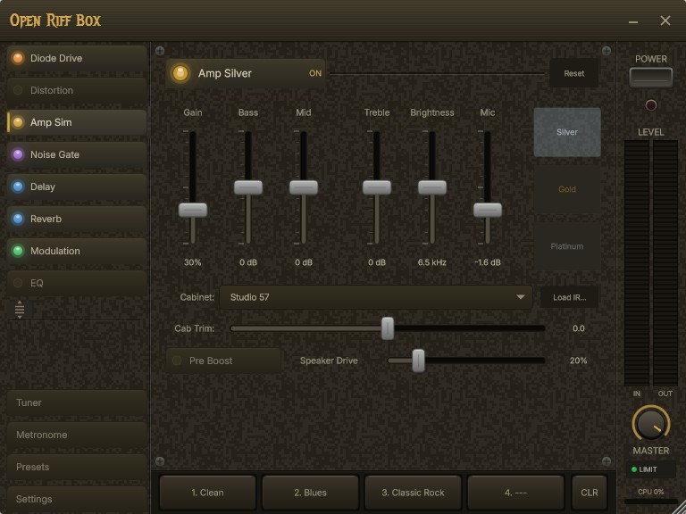
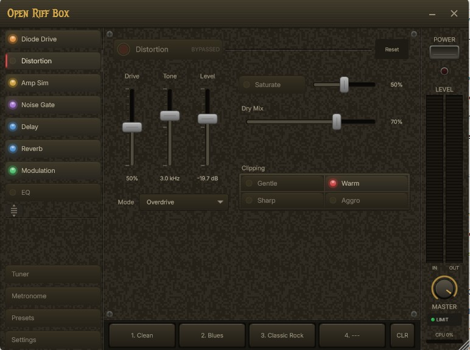
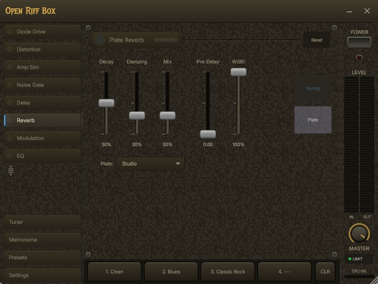
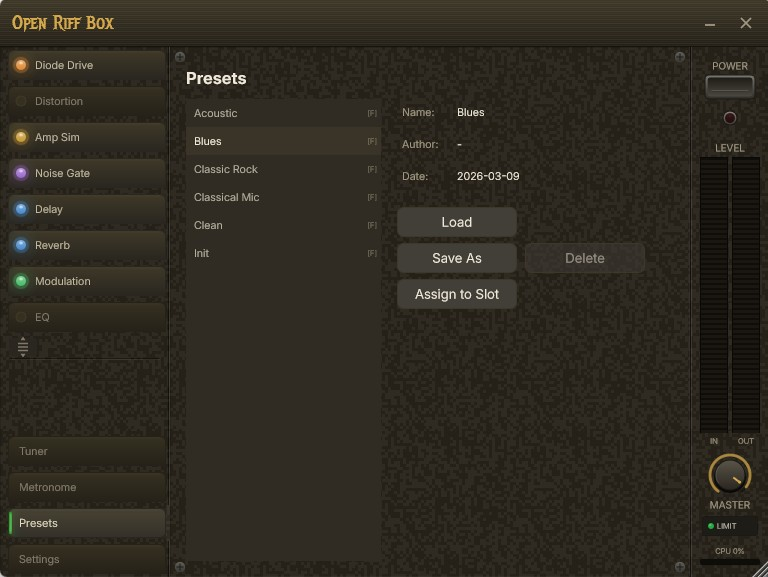

# Open Riff Box

**Free, open-source, lightweight guitar effects processor for Windows.**

Plug in your guitar, choose your effects, and play. No installation required.



<p align="center">
  
  
  
</p>

## Features

- **14 effects across 8 slots** - Noise Gate, Diode Drive, Distortion (4 modes), Amp Sim (3 engines), Analog Delay, Spring Reverb, Plate Reverb, Chorus, Flanger, Phaser, Vibrato, 3-Band EQ
- **3 amp sim engines** - Silver (lightweight, clean to crunch), Gold (full preamp + power amp circuit model), Platinum (5-stage tube preamp, push-pull power amp, transformer, sag)
- **14 cabinet IRs** - Studio 57 to Vox Chime, plus No Cabinet and custom IR loading
- **Real-time processing** - Low-latency audio via ASIO (WASAPI fallback)
- **Reorderable signal chain** - Move effects into any order, or reset to default
- **Built-in tuner** - Pitch detection with analog VU-meter display
- **Preset system** - Save, load, and quick-switch between 4 preset slots
- **Portable** - Single folder, no installer, no registry. Unzip and run.
- **Zero dependencies** - Statically linked, no runtime redistributables needed

## Quick Start

1. Download the latest release `.zip`
2. Extract anywhere
3. Run `OpenRiffBox.exe`
4. Click **Settings** to select your audio interface
5. Enable effects from the chain list on the left
6. Play!

**Requirements:** Windows 10/11 x64. An audio interface with ASIO drivers recommended (WASAPI works for casual use).

## Signal Chain

Default effect order (user-reorderable):

```
I -> Diode Drive -> Distortion -> Amp Sim -> Noise Gate -> Delay -> Reverb -> Modulation -> EQ -> O
```

Each effect can be independently bypassed. The chain includes an always-on input DC blocker and output soft limiter.

Effects with multiple engines (Amp Sim, Reverb, Modulation) use tabbed selectors - switch between engines without losing your settings.

## Effects

| Slot | Effect | Description |
|------|--------|-------------|
| Diode Drive | TS808-style circuit model | Op-amp + diode clipping, mid-focused overdrive |
| Distortion | 4 modes | Overdrive, Tube Drive, Distortion, Metal (3-stage cascaded) |
| Amp Sim | Silver | 3-band EQ, preamp boost, power amp, 14 cabinet IRs |
| | Gold | Multi-stage preamp, circuit-modeled tone stack, push-pull power amp with NFB, power supply sag |
| | Platinum | 5-stage tube preamp cascade, phase splitter, push-pull power amp, output transformer, thermal noise |
| Noise Gate | Full gate | Threshold, attack, hold, release, range, sidechain HPF, hysteresis |
| Delay | BBD analog delay | Feedback saturation, clock-tracking filters, triple LFO modulation |
| Reverb | Spring | Allpass chirp chain, FDN tank, 3 spring types |
| | Plate | Cross-coupled tank, multi-tap stereo output, 3 plate types |
| Modulation | Chorus | Triangle LFO, 180-deg stereo, BBD color filter |
| | Flanger | Comb filter feedback with +/- polarity, soft saturation |
| | Phaser | 4/8/12-stage allpass cascade, 100-4000 Hz sweep |
| | Vibrato | Sine LFO, 100% wet pitch modulation |
| EQ | 3-band semi-parametric | Low shelf, sweepable mid, high shelf, output trim |

See **[docs/effects.md](docs/effects.md)** for detailed parameter documentation and tips.

## Building from Source

### Prerequisites

1. **Visual Studio Build Tools** (MSVC x64/x86 + Windows SDK)
2. **CMake 3.22+**
3. **JUCE 8** (included as git submodule)

### Build

```bash
git clone --recursive https://github.com/dlujic/openriffbox.git
cd openriffbox
cmake -B build -G "Visual Studio 18 2026" -A x64
cmake --build build --config Release
```

Output: `build/OpenRiffBox_artefacts/Release/Standalone/OpenRiffBox.exe`

## Tech Stack

- **Framework:** [JUCE 8](https://juce.com/) (C++17)
- **Build:** CMake + MSVC, static CRT (`/MT`)
- **Audio:** ASIO primary, WASAPI/DirectSound fallback
- **DSP:** 4x oversampled nonlinear processing, circuit-modeled effects, IR convolution cabinets
- **UI:** Custom JUCE components, vintage amp aesthetic

## Project Structure

```
openriffbox/
+-- src/
|   +-- dsp/          # Effect processors (no UI dependencies)
|   +-- ui/           # JUCE UI components
|   +-- preset/       # Preset management
+-- presets/           # Factory and user presets (JSON)
+-- resources/
|   +-- fonts/        # Inter font family
|   +-- irs/          # Cabinet impulse responses
+-- docs/             # Documentation and roadmap
```

## License

[GPLv3](LICENSE) - free as in freedom.

Built with [JUCE](https://juce.com/) under GPLv3. Fonts licensed under [SIL OFL](https://scripts.sil.org/OFL).
