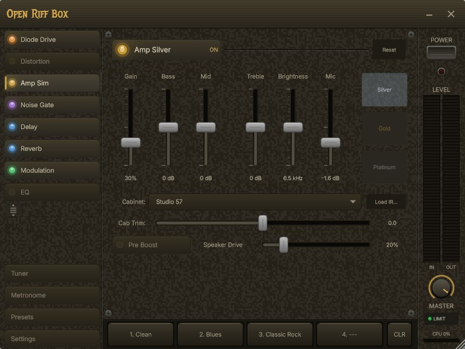
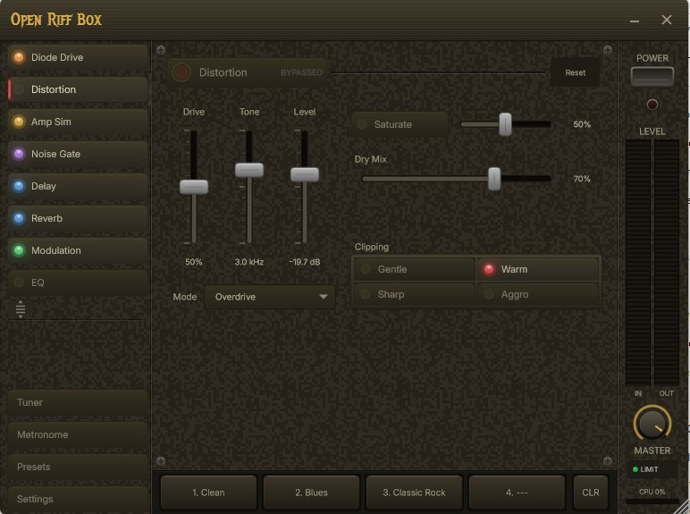
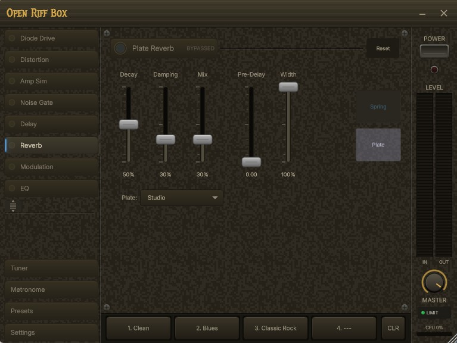
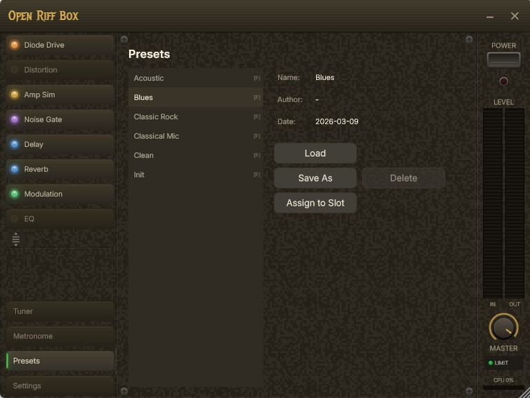

# Open Riff Box

**Free, open-source, lightweight guitar effects processor for Windows, macOS and Linux.**

Plug in your guitar, choose your effects, and play. No installation required.

Windows is the primary, most-tested platform. The macOS and Linux builds are new in 0.9
and labeled **beta** -- lightly tested, reports welcome. If you play on either, please
[open an issue](../../issues) with what worked and what didn't.



<p align="center">
  
  
  
</p>

## Features

- **17 effects across 10 slots** - Compressor (3 modes), Wah (3 control modes), Noise Gate, Diode Drive, Distortion (4 modes), Amp Sim (3 engines), Analog Delay, Spring Reverb, Plate Reverb, Chorus, Flanger, Phaser, Vibrato, Tremolo, 3-Band EQ
- **3 amp sim engines** - Silver (lightweight, clean to crunch), Gold (full preamp + power amp circuit model), Platinum (5-stage tube preamp, push-pull power amp, transformer, sag)
- **14 cabinet IRs** - Studio 57 to Vox Chime, plus No Cabinet and custom IR loading
- **Real-time processing** - Low-latency audio: ASIO/WASAPI on Windows, CoreAudio on macOS, ALSA + JACK on Linux
- **Reorderable signal chain** - Move effects into any order, or reset to default
- **Built-in tuner** - Pitch detection with analog VU-meter display
- **Built-in metronome** - Woodblock click with accented downbeats, 30-300 BPM, tap tempo, time signatures (standalone only)
- **Preset system** - Save, load, and quick-switch between 4 preset slots
- **Portable** - No installer, no registry, no admin rights. Windows/Linux run from a single folder; macOS is a single app bundle (user presets live in `~/Library/Application Support/OpenRiffBox`)
- **Zero dependencies** - No runtime redistributables. Statically linked on Windows; standard system libraries only elsewhere

## Quick Start

### Windows

1. Download `OpenRiffBox-windows-x64.zip` from the latest release
2. Extract anywhere
3. Run `OpenRiffBox.exe`
4. Click **Settings** to select your audio interface
5. Enable effects from the chain list on the left
6. Play!

**Requirements:** Windows 10/11 x64. An audio interface with ASIO drivers recommended (WASAPI works for casual use).

### macOS (beta)

1. Download `OpenRiffBox-macos.tar.gz` and double-click it to unpack
2. The beta is not code-signed yet, so macOS will block the first launch. Either:
   - open it once, then go to **System Settings -> Privacy & Security**, scroll down and click **"Open Anyway"** (on older macOS: right-click the app -> **Open** -> **Open**), or
   - in Terminal: `xattr -cr /path/to/OpenRiffBox.app`
3. Launch `OpenRiffBox.app` and pick your interface in **Settings**

**Requirements:** macOS 10.13+, Intel or Apple Silicon (one universal binary). User presets and settings live in `~/Library/Application Support/OpenRiffBox`.

### Linux (beta)

1. Download `OpenRiffBox-linux-x64.tar.gz` and unpack: `tar -xzf OpenRiffBox-linux-x64.tar.gz`
2. Run `OpenRiffBox/OpenRiffBox`
3. ALSA works out of the box; a running JACK (or PipeWire-JACK) server is picked up automatically

**Requirements:** x86_64 with the usual desktop libraries (ALSA, X11, FreeType, fontconfig -- present on any stock desktop distro).

The macOS and Linux downloads also contain a VST3 build of the same processor (beta, like the standalone).

## Signal Chain

Default effect order (user-reorderable):

```
I -> Compressor -> Wah -> Diode Drive -> Distortion -> Amp Sim -> Noise Gate -> Delay -> Reverb -> Modulation -> EQ -> O
```

Each effect can be independently bypassed. The chain includes an always-on input DC blocker and output soft limiter.

Effects with multiple engines (Amp Sim, Reverb, Modulation) use tabbed selectors - switch between engines without losing your settings.

## Effects

| Slot | Effect | Description |
|------|--------|-------------|
| Compressor | 3 modes | Studio (transparent VCA), Squeeze (Dyna Comp squash), Opto (LA-2A-style); parallel blend, gain reduction meter |
| Wah | GCB-95-style circuit model | Resonant sweep with pot-taper dead zones; Manual, Auto (LFO) and Envelope control modes |
| Diode Drive | TS808-style circuit model | Op-amp + diode clipping, mid-focused overdrive |
| Distortion | 4 modes | Overdrive, Tube Drive, Distortion, Metal (3-stage cascaded) |
| Amp Sim | Silver | 3-band EQ, preamp boost, power amp, 14 cabinet IRs |
| | Gold | Multi-stage preamp, circuit-modeled tone stack, push-pull power amp with NFB, power supply sag |
| | Platinum | 5-stage tube preamp cascade, phase splitter, push-pull power amp, output transformer, thermal noise |
| Noise Gate | Full gate | Threshold, attack, hold, release, range, sidechain HPF, hysteresis |
| Delay | BBD analog delay | Feedback saturation, clock-tracking filters, triple LFO modulation |
| Reverb | Spring | Allpass chirp chain, FDN tank, 3 spring types |
| | Plate | Cross-coupled tank, multi-tap stereo output, 3 plate types |
| Modulation | Chorus | Triangle LFO, 180-deg stereo, BBD color filter |
| | Flanger | Comb filter feedback with +/- polarity, soft saturation |
| | Phaser | 4/8/12-stage allpass cascade, 100-4000 Hz sweep |
| | Vibrato | Sine LFO, 100% wet pitch modulation |
| | Tremolo | 3 modes (Photo / Bias / Harmonic), make-up gain, mono-safe stereo width |
| EQ | 3-band semi-parametric | Low shelf, sweepable mid, high shelf, output trim |

See **[docs/effects.md](docs/effects.md)** for detailed parameter documentation and tips.

## Building from Source

CMake 3.22+ and a C++17 compiler. JUCE 8 is included as a git submodule -- clone with `--recursive`.

```bash
git clone --recursive https://github.com/dlujic/openriffbox.git
cd openriffbox
```

**Windows** (Visual Studio Build Tools, MSVC x64 + Windows SDK):

```bash
cmake -B build -G "Visual Studio 18 2026" -A x64
cmake --build build --config Release
```

**macOS** (Xcode command-line tools):

```bash
cmake -B build -DCMAKE_BUILD_TYPE=Release
cmake --build build --parallel
```

**Linux** (GCC or Clang, plus the JUCE dev packages):

```bash
sudo apt install libasound2-dev libjack-jackd2-dev libx11-dev libxrandr-dev \
    libxinerama-dev libxcursor-dev libfreetype-dev libfontconfig1-dev
cmake -B build -DCMAKE_BUILD_TYPE=Release
cmake --build build --parallel
```

Output lands in `build/OpenRiffBox_artefacts/Release/Standalone/` (the portable folder with presets is assembled in `build/dist/OpenRiffBox` on Windows/Linux).

## Tech Stack

- **Framework:** [JUCE 8](https://juce.com/) (C++17)
- **Build:** CMake -- MSVC on Windows (static CRT `/MT`), Clang on macOS (universal binary), GCC/Clang on Linux
- **Audio:** ASIO/WASAPI/DirectSound on Windows, CoreAudio on macOS, ALSA + JACK on Linux
- **DSP:** 4x oversampled nonlinear processing, circuit-modeled effects, IR convolution cabinets
- **UI:** Custom JUCE components, vintage amp aesthetic

## Project Structure

```
openriffbox/
+-- src/
|   +-- dsp/          # Effect processors (no UI dependencies)
|   +-- ui/           # JUCE UI components
|   +-- preset/       # Preset management
+-- presets/           # Factory and user presets (JSON)
+-- resources/
|   +-- fonts/        # Inter font family
|   +-- irs/          # Cabinet impulse responses
+-- docs/             # Documentation and roadmap
```

## License

[GPLv3](LICENSE) - free as in freedom.

Built with [JUCE](https://juce.com/) under GPLv3. Fonts licensed under [SIL OFL](https://scripts.sil.org/OFL).
